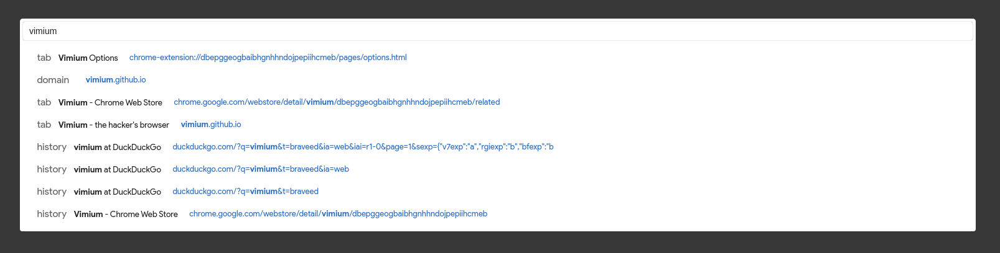
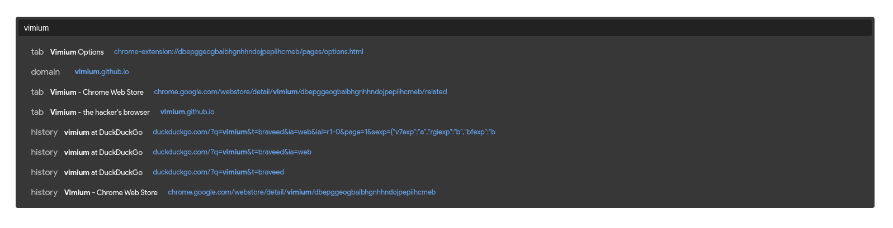

# vimium-css
With the Vimium or Vimium-C browser extensions, you can customize the appearence of the vomnibar and UI (hint markers and find dialog). This repo provides a variety of already written styles to use.

## How to use

1. Vimium and Vimium-C use different styling and tags to each other. Check which ectension you are using and choose the correct style accordingly (`[style]-vimium.css` or `[style]-vimium-c.css`). Copy the style.

2. Go to `Vimium (C) Options > Show Advanced Options > CSS for Vimium (C) UI`, and paste the css style in the box.

3. Choose a theme for the style from its `themes` folder. Paste the theme wherever the styling reads `/* PLACE DESIRED THEME HERE */`.

4. Feel free to change any of the values in the theme to create your custom theme. Once you're done, save and you're good to go!

## Styles
### Vomnibar styles
* #### Chrome

---

### UI Styles
* #### Rounded
Rounded corners UI design
* #### Metro
Simple as it gets. Sharp and rectangular

## Contributing
Feel free to add CSS styles or themes and create a PR!