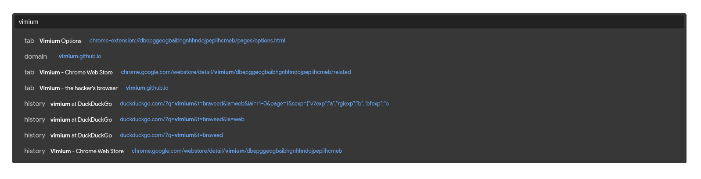

# vimium-css
This repo contains a variety of css snippets intended for improving the mediocre default styling of vimium elements.

## How to use
Just go to your vimium advanced options > CSS for Vimium UI, and paste your desired theme at the top.
The paste the actual css style underneath. Save and you're good to go!

## Styles
### Vomnibar
#### Chrome

This styling mimicks the existing Chrome omnibar. Themes use default Chrome light and dark theme colours.

### Hintmarker
#### Button
Simple rounded corners button design with a flat drop shadow
#### Metro
Simple as it gets (just a rectangle, removes all default styles)

## Contributing
Feel free to add snippets and create a PR!